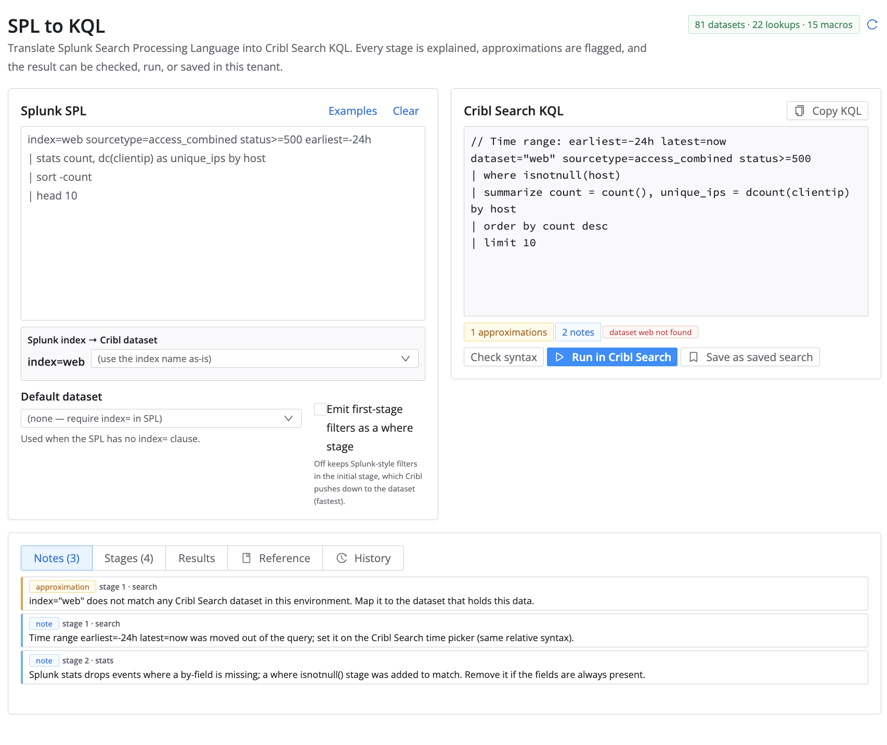

# SPL to KQL

Translate Splunk Search Processing Language (SPL) into Cribl Search KQL, with a stage-by-stage explanation of what changed, what was approximated, and what still needs a human.



## Summary

SPL to KQL is a Cribl app for teams moving searches, alerts and dashboards from Splunk to Cribl Search. It helps users translate SPL pipelines into runnable KQL, understand every approximation the translation made, and verify the result against their own Cribl tenant without leaving the app.

## What This App Does

* Primary purpose: deterministic, rule-based translation of SPL into the KQL dialect that Cribl Search actually accepts (verified against a live tenant, not generic Kusto).
* Key capabilities:
  * Translates 60+ SPL commands (search, eval, where, stats, eventstats, streamstats, timechart, chart, top, rare, rex, regex, lookup, inputlookup, outputlookup, join, append, dedup, bin, fillnull, spath, makemv, mvexpand, tstats, rangemap, replace, convert, and more) and 90+ eval functions.
  * Explains every stage: informational notes for semantic differences, warnings for approximations, and errors for commands that have no Cribl equivalent (left in the output as `// TODO` comments so nothing is silently dropped).
  * Validates `index=` names against your datasets, `lookup` tables against your uploaded lookups, and `` `macros` `` against Cribl Search macros.
  * Checks the generated query with Cribl's own parser (the Search preview endpoint), without running a search.
  * Runs the query as a real search job from the app and shows results, or saves it as a Cribl Search saved search.
  * Maps Splunk index names to the Cribl datasets that hold the same data, per user.
  * Reproduces Splunk search-time fields and CIM normalization in Cribl: load your TAs and the CIM app (packages, .conf files or a knowledge bundle) and the translator emits the extractions, field aliases, calculated fields and lookups for each sourcetype, expands `tag=`/`eventtype=` and macros, and translates `tstats ... from datamodel=`, `| datamodel` and `| from datamodel:`.
  * Built-in reference: an SPL to KQL cheat sheet and the operator/function catalog loaded from your tenant.
  * Per-user conversion history, kept in the app KV store.
* Intended users:
  * Analysts and engineers migrating Splunk content to Cribl Search.
  * Admins evaluating what a migration will and will not cover.
* Works with:
  * Cribl.Cloud (Cribl Search). Runs against the `default_search` group.

## When To Use This App

* Migrating saved searches, alerts and dashboard panels from Splunk to Cribl Search.
* Learning KQL by seeing a familiar SPL query side by side with its Cribl equivalent.
* Auditing which SPL features in a content library have no Cribl equivalent before committing to a migration.

## Before You Install

* Required Cribl product or deployment type: Cribl.Cloud with Cribl Search.
* Required permissions or roles: the app declares read access to Search datasets, lookups, macros and docs, plus the ability to create search jobs and saved searches. Admins grant these when sharing the app.
* Required external systems or APIs: none. The app makes no external calls.
* Required configuration values: none. An optional default dataset can be set per user.
* Known limits or prerequisites: translation is rule based, not AI based. It does not know your field extractions, so field names pass through unchanged.

## Installation

### Install From Marketplace or URL
1. Go to Apps in your Cribl environment.
2. Choose the Marketplace or import from URL option.
3. If the app is available in the Cribl Marketplace, install it directly from there.
4. If the app is distributed as a Marketplace-hosted URL, use the URL to import it.
5. Review the app details and complete installation.

### If The App Is Not Yet In The Cribl Marketplace
1. Run `npm run package` in this repository to produce the `.tgz` app package (or download it from the Releases section).
2. In Cribl, go to Apps and choose import from file.
3. Upload the `.tgz` file.
4. Review the app details and complete installation.

## Configuration

| Setting | Required | Description | Example | Scope |
|---|---|---|---|---|
| Splunk knowledge | No | Add-on packages, .conf files, data model JSON or a knowledge.json bundle; enables search-time field reproduction and data model translation. | `Splunk_SA_CIM.tgz`, `TA-apache.tgz` | per-user |
| Splunk index → Cribl dataset | No | Per-index override used when the Splunk index name differs from the Cribl dataset id. Shown for every `index=` the SPL references. | `main` → `default_logs` | per-user |
| Default dataset | No | Dataset used when the SPL has no `index=` clause. When unset the output contains `dataset="<DATASET>"` and an error note. | `default_logs` | per-user |
| Emit first-stage filters as a where stage | No | Off (default) keeps Splunk-style filters in Cribl's initial stage, which is pushed down to the dataset provider. On moves them to a `where` stage. | off | per-user |
| Earliest / Latest | No | Time range used when running or saving the translated query. Pre-filled from `earliest=`/`latest=` in the SPL. | `-24h` / `now` | per-user |

All settings are saved in the app KV store per user and restored on the next visit.

## How To Use

### Typical Workflow
1. Open the app from the Apps page.
2. Paste an SPL query on the left (or pick one from Examples). The KQL updates as you type.
3. Read the summary tags under the KQL: needs attention, approximations, notes, and whether referenced datasets, lookups and macros exist in this tenant.
4. Open the Notes tab for the reasoning behind each change, or the Stages tab to see each SPL stage next to the KQL it produced.
5. Use Check syntax to have Cribl's parser accept the query, Run in Cribl Search to execute it, or Save as saved search to keep it.
6. Copy KQL to use it anywhere else.

### First-Run Checklist
* Confirm the status tag in the header shows your datasets, lookups and macros were loaded.
* Set a default dataset if your SPL library relies on a default index.
* Try the “Unsupported commands” example to see how untranslatable stages are reported.

## Splunk Knowledge And CIM

Splunk fields such as `src`, `action` or `Web.status` exist only because add-ons define search-time extractions, aliases, calculated fields, lookups, eventtypes and tags. The **Splunk knowledge** tab loads those definitions so the translation reproduces them in Cribl Search.

What to load:

* Add-on packages (`.tgz`/`.spl`) or their `props.conf`, `transforms.conf`, `eventtypes.conf`, `tags.conf`, `macros.conf` files.
* The Common Information Model app (`Splunk_SA_CIM`) for data model definitions (`default/data/models/*.json`), or individual model JSON files.
* A `knowledge.json` bundle built from a Splunk install: `npm run knowledge -- $SPLUNK_HOME/etc/system $SPLUNK_HOME/etc/apps/Splunk_SA_CIM $SPLUNK_HOME/etc/apps/<TA> --out knowledge.json`.

What the translator does with it, in Splunk's search-time order:

| Splunk knowledge object | Emitted KQL |
|---|---|
| `EXTRACT-x = (?<f>...)` and `REPORT-x` transforms (`REGEX`, `FORMAT`, `[[macro]]` references) | `extract type=regex regex=@"..."` (PCRE possessive/atomic syntax rewritten; lookarounds and backreferences are flagged) |
| `DELIMS`/`FIELDS` transforms | `extract type=delim delimiter="," "a,b,c"` |
| `FIELDALIAS-x = a AS b` / `ASNEW` | `extend b = a` / `extend b = coalesce(b, a)` |
| `EVAL-f = expr` | `extend f = <translated expr>` |
| `LOOKUP-x = def field OUTPUT ...` (with `match_type = CIDR(...)`) | `lookup [matchMode=cidr] output="..." file on field` |
| `tag=web`, `eventtype=x`, `` `macro` `` | expanded to the eventtype searches (index= terms become the dataset scope) |
| `tstats ... from datamodel=Web.Web`, `\| datamodel Web Web search`, `\| from datamodel:"Web.Web"` | dataset scope from the object's constraints, sourcetype field stages, the model's calculated fields, then the aggregation with `Web.` prefixes stripped |

Filters on extracted fields are moved after the field stages so the fields exist when they are evaluated. Lookups referenced by the knowledge must exist in Cribl Search as lookup files (the app validates their names).

Verified end to end: identical Apache access logs were loaded into Splunk (`sourcetype=access_combined`, with `Splunk_SA_CIM` and a CIM web TA installed) and into Cribl Search, and 26 CIM-normalized queries (`stats by src, action, status_description`, `tag=web`, `eventtype=`, `tstats from datamodel=Web.Web ...`, `| datamodel`, `| from datamodel:`) returned identical results in both.

## Permissions

Required permissions for core functionality (declared in `config/policies.yml`):

### Cribl API Endpoints Used

| Method | Endpoint | Purpose |
|---|---|---|
| GET | `/api/v1/m/default_search/search/datasets` | Map `index=` to datasets and warn about unknown names |
| GET | `/api/v1/m/default_search/system/lookups` | Validate `lookup` / `inputlookup` table names |
| GET | `/api/v1/m/default_search/search/macros` | Validate macro references |
| GET | `/api/v1/m/default_search/search/docs` | Operator and function catalog for the Reference tab |
| POST | `/api/v1/m/default_search/search/preview` | Check syntax with Cribl's parser (no search job, no credits) |
| POST | `/api/v1/m/default_search/search/jobs` | Run the translated query (explicit user action, confirmed in a dialog) |
| GET | `/api/v1/m/default_search/search/jobs/:id` | Poll job status |
| GET | `/api/v1/m/default_search/search/jobs/:id/results` | Fetch results |
| GET | `/api/v1/m/default_search/search/jobs/:id/logs` | Surface the failure reason for a failed job |
| POST | `/api/v1/m/default_search/search/jobs/:id/cancel` | Cancel a running job |
| GET | `/api/v1/m/default_search/search/saved/:id` | Check that a saved search id is free before creating it |
| POST | `/api/v1/m/default_search/search/saved` | Create a saved search (explicit user action, never overwrites) |

If a user lacks access to an optional endpoint (datasets, lookups, macros, docs), translation still works and the header shows which metadata could not be loaded. Running and saving require the job and saved-search permissions.

## External API Access

This app makes no external calls. `config/proxies.yml` declares no domains.

## Data And Storage

* KV keys: `users/<userId>/history` (last 50 conversions), `users/<userId>/prefs` (default dataset, index mapping, filter mode, time range) and `users/<userId>/knowledge` (the loaded Splunk knowledge bundle).
* Data is persisted per user and is not shared across users.
* Running a query creates a search job in Cribl Search like any other search. Saving creates a saved search. `outputlookup` translations become `export to lookup`, which writes a lookup when the query runs; the app flags this with a warning.

## Known Limitations

* Translation is deterministic. Without loaded Splunk knowledge, field names pass through unchanged and data models, `tag=` and `eventtype=` cannot be resolved. With it, extractions that need PCRE-only regex features (lookarounds, backreferences), `FORMAT = $1::$2` key-value transforms, KV-store lookups, WILDCARD lookups and GeoIP calculations are reported rather than translated. Splunk `EXTRACT ... in <field>` runs before `REPORT` extractions, in both systems.
* Commands with no Cribl equivalent (`transaction`, `transpose`, `untable`, `appendcols`, `map`, `foreach`, `return`, `format`, `mvcombine`, most ML commands) are emitted as `// TODO` comments with an error note.
* Some semantics differ and are flagged as notes: `dedup` works within a time window in Cribl; `coalesce()`/`fillnull` also replace empty strings; `strcat()` treats missing fields as empty (Splunk's `.` yields null); `first()`/`last()` map to `findlatest()`/`findearliest()`; `timestats` omits empty buckets and needs the `@` snap suffix to align buckets to the clock; `stats ... by` gets a `where isnotnull()` stage because Cribl keeps a null group.
* Regular expressions: `rex`, `extract` and `replace_regex` use RE2 (no lookarounds); `matches regex` uses ECMAScript regex literals.
* Check syntax uses the Search preview endpoint. It parses and plans the query but does not apply dataset scope, filters, window functions or subqueries, so it cannot validate results. Run the query for that.
* `iplocation` requires a GeoIP `.mmdb` lookup uploaded to Cribl Search; the placeholder name `geocity` must be replaced.
* Splunk macros with arguments have no equivalent; Cribl macros are emitted as `${name}`.

## Troubleshooting

### The App Opens But Some Features Do Not Work
Possible causes:
* The header shows “Offline: translation only”: the app is running outside Cribl (for example `npm run dev` opened directly). Open it from the Cribl Apps page.
* The header shows “Partial tenant data”: one of the metadata endpoints was denied. Check the app's shared policies.

### The App Cannot Connect To An API Or Service
Check:
* The app is shared with your user by an admin (this grants the declared policies).
* Cribl Search is enabled for the workspace.

### Run in Cribl Search fails
Check:
* The Results tab shows the job's error lines. Common causes are an unresolved `<DATASET>` placeholder, an unsupported `// TODO` stage that still needs manual work, or a lookup that does not exist in this tenant.

## Development

```bash
npm install
npm run dev        # live preview (open from Cribl's app dev page for API access)
npm test           # translator unit tests (vitest)
npm run translate -- 'index=web | stats count by host'   # CLI translation
npm run knowledge -- $SPLUNK_HOME/etc/system $SPLUNK_HOME/etc/apps/Splunk_SA_CIM --out knowledge.json   # Splunk knowledge bundle
npm run package    # build and create the .tgz app package
```

* `src/translator/` is a standalone, dependency-free module. It can be reused from Node or another app.
* `scripts/translate.ts` is a small CLI around it. Add `--json` for the full result (stages, notes, time range) and `--filters-as-where` to emit first-stage filters as `where`.
* `src/data/kql-catalog.ts` is a snapshot of the operator/function catalog from `GET /search/docs`; the app loads the live bundle at runtime and falls back to the snapshot.
* Translations were verified with a differential test: the same events were loaded into Splunk (index `main`) and Cribl Search (as a lookup), 70 SPL queries were run in both, and the results compared row for row. The remaining differences are the documented semantic ones above.

## Project Layout

```text
src/
  App.tsx                 main UI
  knowledge/              Splunk knowledge: conf parsers, PCRE→RE2 regex conversion, sourcetype shim, data models, package reader
  api.ts                  Cribl REST calls (datasets, lookups, macros, docs, preview, jobs, saved searches, KV)
  translator/             SPL → KQL translator (lexer, expressions, search scope, commands, entry point)
  components/             Notes, Stages, Results, Reference, History panels
  data/                   KQL catalog snapshot and cheat sheet
  examples.ts             sample SPL queries
images/                   README screenshots
scripts/
  translate.ts            CLI (--knowledge knowledge.json)
  knowledge-from-dir.ts   build a knowledge bundle from Splunk app folders
  package.mjs             app packaging
tests/                    vitest suites
config/
  policies.yml            Cribl API paths the app needs
  proxies.yml             external domains (none)
```

## Versioning And Releases

* Semantic versioning. `npm run package` bumps the patch version; use `-- --minor` or `-- --major` for larger changes.
* Tagged releases carry the `.tgz` package for manual installs.

## Support

### Community Built
This app is provided as a community contribution by VisiCore. It does not carry an official support commitment from Cribl. Open an issue in the repository or email CriblPacks@VisiCoreTech.com.

## License

This app is licensed under the Apache License 2.0.

## App Metadata

| Field | Value |
|---|---|
| App Name | SPL to KQL |
| App ID | cc-visicore-spl-to-kql |
| Version | 1.1.0 |
| Author | VisiCore (Andrew Hendrix) |
| Support Model | community-built |
| Support Label | Community Built |
| Support Contact | CriblPacks@VisiCoreTech.com or GitHub issues |
| License | Apache-2.0 |
| License File | [Apache License 2.0](https://www.apache.org/licenses/LICENSE-2.0.txt) |
| Product Tags | search |
| Category | Migration |
| Audience | analyst, admin, builder |
| Availability | preview |
| Requires External Access | no |
| Repository | https://github.com/Cribl-Community/cc-visicore-spl-to-kql |
| Documentation | this README |
| README Schema Version | 1.0 |
